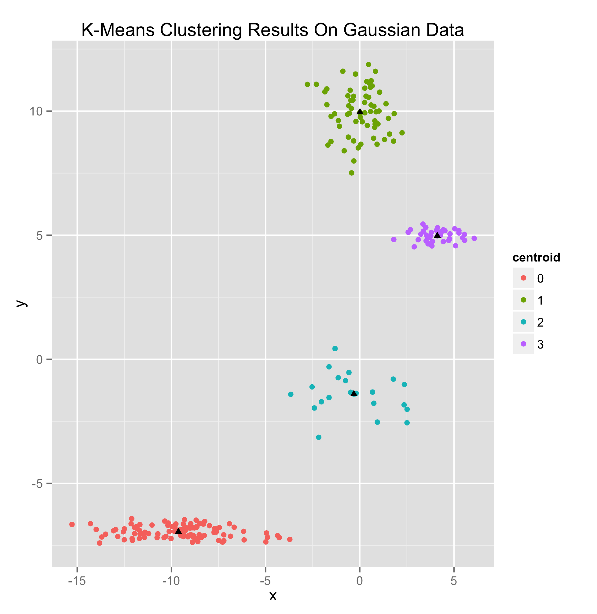

## K-Means Algorithms 


- [k-means clustering](kmeans.go)
    * Uses k-means++ instantiation for more reliable clustering ([this paper](http://ilpubs.stanford.edu:8090/778/1/2006-13.pdf) outlines the method)
	* Both online and batch versions of the algorithm
	* Online version implements the algorithm discussed in [this paper](http://ocw.mit.edu/courses/sloan-school-of-management/15-097-prediction-machine-learning-and-statistics-spring-2012/projects/MIT15_097S12_proj1.pdf)


### example k-means model usage

This code produces four clusters (as expected,) which result in the following plot (made with `ggplot2`).

Data Clustered By The K-Means Unsupervised Clustering Algorithm



```go
gaussian := [][]float64{}
for i := 0; i < 40; i++ {
	x := rand.NormFloat64() + 4
	y := rand.NormFloat64()*0.25 + 5
	gaussian = append(gaussian, []float64{x, y})
}
for i := 0; i < 66; i++ {
	x := rand.NormFloat64()
	y := rand.NormFloat64() + 10
	gaussian = append(gaussian, []float64{x, y})
}
for i := 0; i < 100; i++ {
	x := rand.NormFloat64()*3 - 10
	y := rand.NormFloat64()*0.25 - 7
	gaussian = append(gaussian, []float64{x, y})
}
for i := 0; i < 23; i++ {
	x := rand.NormFloat64() * 2
	y := rand.NormFloat64() - 1.25
	gaussian = append(gaussian, []float64{x, y})
}

model := NewKMeans(4, 15, gaussian)

if model.Learn() != nil {
	panic("Oh NO!!! There was an error learning!!")
}

// now you can predict like normal!
guess, err := model.Predict([]float64{-3, 6})
if err != nil {
	panic("prediction error")
}

// or if you want to get the clustering
// results from the data
results := model.Guesses()

// you can also concat that with the
// training set and save it to a file
// (if you wanted to plot it or something)
err = model.SaveClusteredData("/tmp/.goml/KMeansResults.csv")
if err != nil {
	panic("file save error")
}

// you can also persist the model to a
// file
err = model.PersistToFile("/tmp/.goml/KMeans.json")
if err != nil {
	panic("file save error")
}

// and also restore from file (at a
// later time if you want)
err = model.RestoreFromFile("/tmp/.goml/KMeans.json")
if err != nil {
	panic("file save error")
}
```

### Reference 

- <https://github.com/cdipaolo/goml/tree/master/cluster>